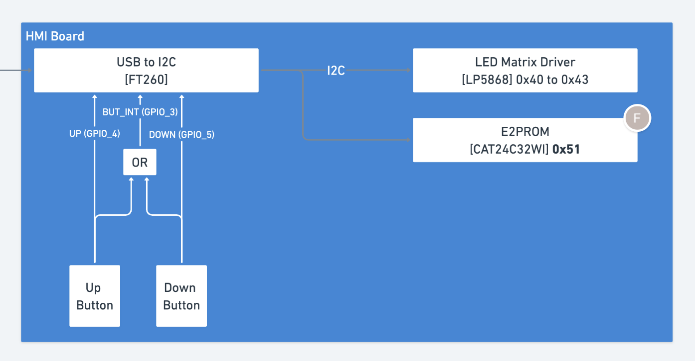
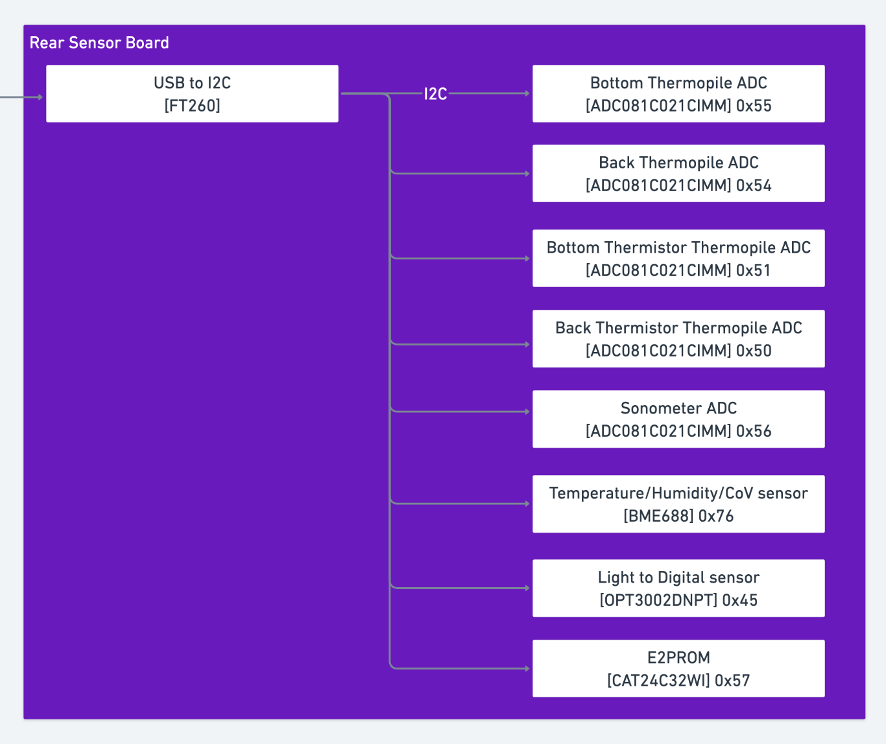
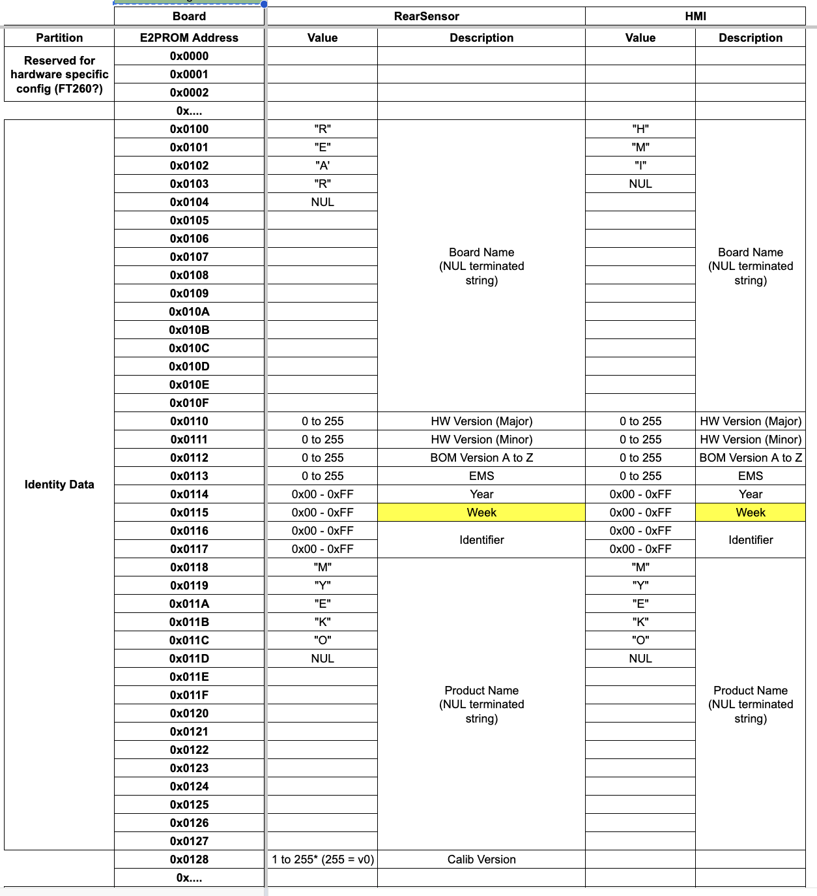

# Technical test - Embedded Software Engineer

## Introduction

MyEko is composed of several PCBs and this test will make use of 2 of them:

* the HMI board, with a LED matrix (controlled over i2c) and 2 buttons (via GPIO)
* the rear sensor board, with a number of sensors like thermistors, thermopiles, air temperature and humidity, etc. All those sensors are avilable over i2c.

Both boards use an i2c-usb bridge to communicate with the host computer, using a FT260 chip.

## Constraints

You can use the programming language of your choice, but you should provide instructions to build and/or run your code.

You can treat the objectives in the order you prefer.

You have full access to the internet and you are encouraged to use it.

## Objectives

Objective 1: Read and display the board info from the EEPROM of both boards.

Objective 2: Implement a simple application that reads the temperature from the Back Thermistor of the rear sensor board.

Objective 3: Implement a simple application that reacts to button presses on the HMI board. You can ignore the interrupt and simply poll the 2 GPIOs.

Note: using the screen of the HMI is not trivial and out of scope for this test.

## Resources

There is a kernel driver for the FT260: https://github.com/MichaelZaidman/hid-ft260

An older version is available in the kernel, but you should use the one from the link above instead.

This driver will create an i2c bus `/dev/i2c-xxx` and a gpiochip `/dev/gpiochipXXX` for each FT260.

## Board info

This graph shows the components of the HMI board and their i2c addresses:

This graph shows the components of the rear sensor board and their i2c addresses:

This table shows the EEPROM layout of both boards:

Note: MSB to LSB for all registers (BIG ENDIAN). Max adressing is 0x0FFF.
